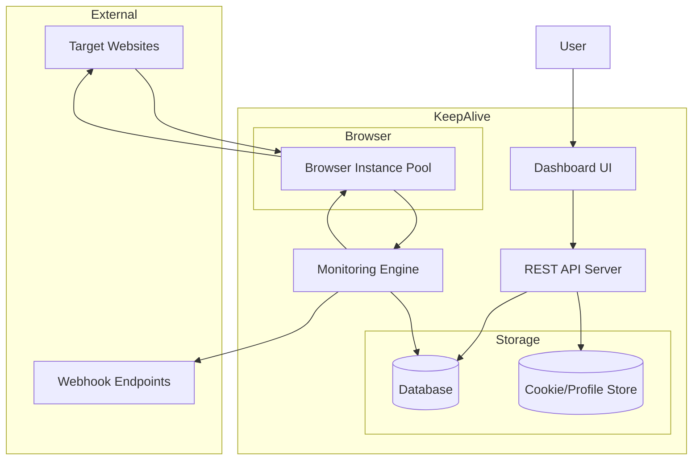
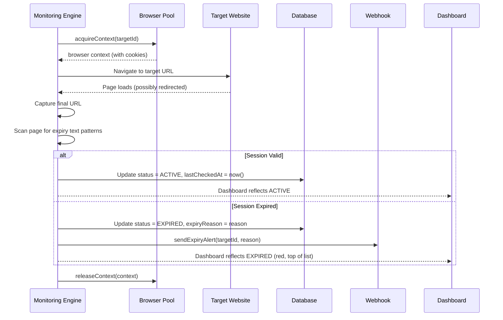

# Architecture Plan - KeepAlive Session Monitor

## 1. Overview
KeepAlive is an automated session monitoring system that tracks the health of web sessions across multiple targets (websites/services) without requiring manual login. Sessions are maintained exclusively through pre-imported cookies or browser profiles. The system automatically detects session expiry by analyzing page redirects and content, and alerts users via webhooks and a dashboard.

## 2. Core Principles
- **Zero Manual Login:** No interactive login is ever required. All sessions are established using pre-imported cookies or browser profiles (JSON import).
- **Automated Session Expiry Detection:** Periodically checks each target URL using an automated browser. Detects expiry by monitoring for login redirects and session-expiry text patterns.
- **Clear Expiry Visibility:** Dashboard prominently displays `EXPIRED` targets so users know exactly when to import updated cookies.

## 3. High-Level Architecture

## 4. Component Responsibilities

### 4.1 REST API Server
- **Responsibility:** Serve as the central API for dashboard UI and external integrations.
- **Public Interface:**
  - `GET /api/targets` - List all monitored targets with status
  - `POST /api/targets` - Add a new target to monitor
  - `PUT /api/targets/:id` - Update target configuration
  - `DELETE /api/targets/:id` - Remove a target
  - `POST /api/cookies/import` - Import cookies/profile (JSON format)
  - `GET /api/status` - System health check
- **Dependencies:** Database, Cookie Store

### 4.2 Monitoring Engine
- **Responsibility:** Periodically visit each target URL using an automated browser with pre-loaded cookies. Detect session expiry by analyzing page navigation and content.
- **Session Expiry Detection Logic:**
  1. Load cookies/profile for target from Cookie Store
  2. Acquire browser context with pre-loaded cookies (no login interaction)
  3. Navigate to target URL
  4. Capture the final URL after any redirects
  5. Check if final URL contains **login redirect patterns** (e.g., `/login`, `/signin`)
  6. Scan page content for **session expiry text indicators** (e.g., "Session expired", "Please log in")
  7. If expiry detected: Set target status to `EXPIRED`, record reason, trigger alert webhook, update dashboard
  8. If session valid: Set target status to `ACTIVE`, update `lastCheckedAt`
  9. If network/navigation error: Set target status to `ERROR`, do NOT mark as expired
- **Dependencies:** Browser Pool, Database, Cookie Store, Webhook Sender

### 4.3 Dashboard UI
- **Responsibility:** Provide a visual interface for managing targets, viewing session status, and importing cookies.
- **Expiry Display Requirements:**
  - `EXPIRED` targets appear at the top of the list, highlighted in red
  - Each expired target shows: last successful check time, detected expiry reason (redirect URL or matched text)
  - Prominent "Import New Cookie" button for expired targets
- **Dependencies:** REST API Server

### 4.4 Browser Instance Pool
- **Responsibility:** Manage a pool of headless browser instances, each configured with specific cookie/profile data for authenticated session access.
- **Dependencies:** Cookie/Profile Store

### 4.5 Cookie/Profile Store
- **Responsibility:** Securely store and retrieve cookie data and browser profiles that have been pre-imported.
- **Dependencies:** Database (encrypted storage)

### 4.6 Webhook Sender
- **Responsibility:** Send alert notifications to configured webhook endpoints when session expiry is detected.
- **Payload Format:** Includes `target_id`, `status: EXPIRED`, `reason`, and `timestamp`.
- **Dependencies:** HTTP Client

## 5. Session Expiry Detection Flow

## 6. Technology Recommendations
- **Backend:** Node.js (Fastify)
- **Browser Automation:** Playwright
- **Database:** SQLite or PostgreSQL
- **Frontend:** Vue 3 or Alpine.js
- **Real-time Updates:** Server-Sent Events (SSE)
